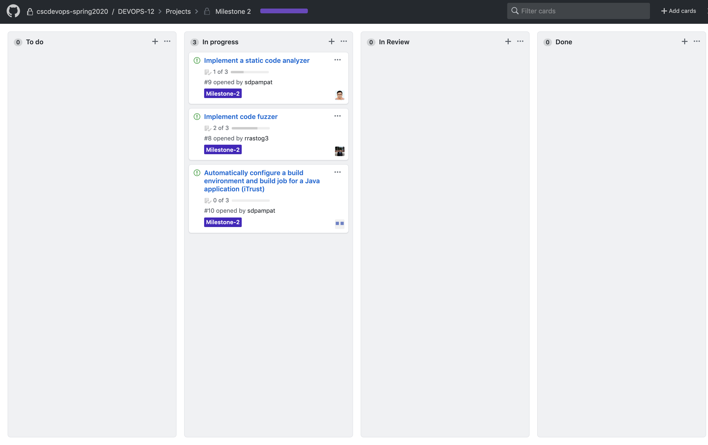
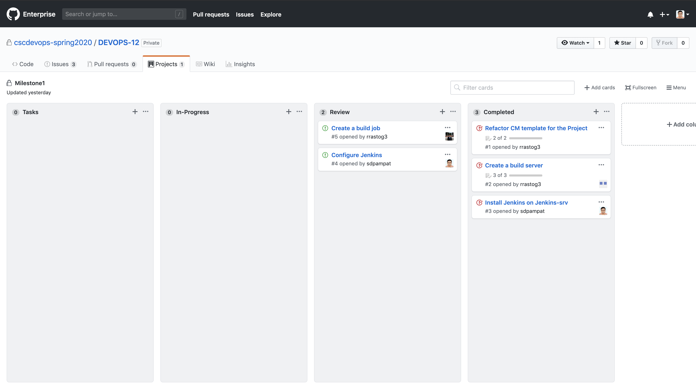

# Milestone 2

## Checkpoint 1

### Tasks Completed

1. Add a component for mutation testing
    - Mutate java files
    - Run build and test suite locally

2. Add a component for static code analysis
    - Include code analysis stage in the build pipeline
    - Fetch javascript files for code analysis
    - Detection of Long methods
    
### Upcoming Tasks

1. Mutation testing
    - Parse output of test suite
    - Run test suite for multiple iterations
    - Integerate component with other tasks by changing paths from local to remote

2. Static code analysis
    - Detection of message chains
    - Detection of nesting depth per function
    - Failure of the build job based on metrics
    
### Project Board

# Milestone 1

## Checkpoint 1 

### Tasks Completed 

1. Refactoring CM-Template for project use.
    - Creating Jenkins server
    - Setting up top level commands
2. Installing Jenkins
3. Configure Build Server
    - Install Mongodb
    - Configure Mongodb
    - Install NodeJS
    - modified ansible_vault to supply password automatically (for demonstration only.)

### Upcoming Tasks

1. Configuring Jenkins
2. Writing Jenkins job to build checkbox.io
 
### Project board

## Checkpoint 2

### Tasks completed

1. Writing Jenkins pipeline
2. Adding code to trigger jenkins pipeline using jenkins-jobs
3. Fetching build logs
4. Configuring Jenkins

### Upcoming Tasks

1. Fix authentication issue during jenkins configuration
2. Investigate failure of 1 test in npm test.

### Project board

