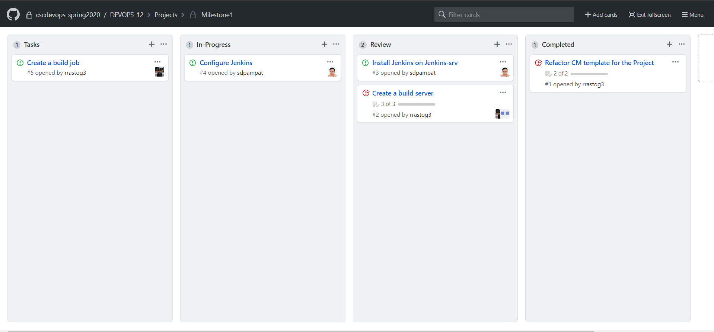

# Checkpoint 1 

## Tasks Completed 

1. Refactoring CM-Template for project use.
    - Creating Jenkins server
    - Setting up top level commands
2. Installing Jenkins
3. Configure Build Server
    - Install Mongodb
    - Configure Mongodb
    - Install NodeJS

## Upcoming tasks

1. Configuring Jenkins
2. Writing Jenkins job to build checkbox.io
 
## Project board

# Checkpoint 2

## Tasks completed

1. Writing Jenkins pipeline
2. Adding code to trigger jenkins pipeline using jenkins-jobs
3. Fetching build logs
4. Configuring Jenkins

## Upcoming tasks

1. Fix authentication issue during jenkins configuration
2. Investigate failure of 1 test in npm test.
